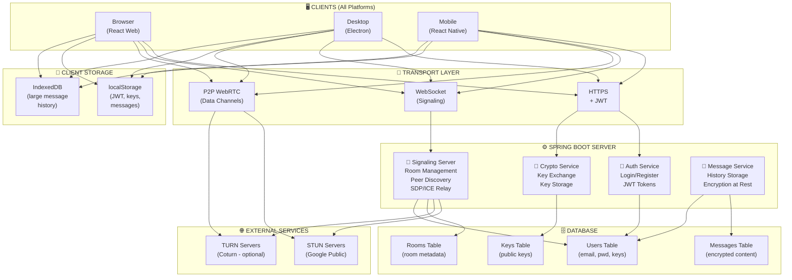
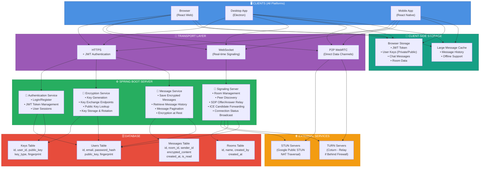

# miniChat

[**Deck board**](https://github.com/hoss-java/minichat/blob/main/DECK.md)


## High-Level Architecture Plan

Building a **signaling server** (Spring Boot) + **chat clients** (React). 

What to think about:

### Backend (Spring Boot)
- **WebSocket setup** for real-time communication between clients and server
- **User registration/login** and session management
- **Room/peer discovery** — how clients find each other
- **Signaling messages** — exchange SDP offers/answers and ICE candidates (for P2P)
- **Message routing** — relay signals between peers until they connect directly

### Frontend (React)
- **WebRTC implementation** — establish peer connections after signaling
- **UI for chat** — message input, display, user list
- **Connection state management** — track who's online, connection status
- **Error handling** — fallback if P2P fails

### Key Decisions
- **Pure P2P or hybrid?** Do messages route through server after P2P connects, or only signaling?
- **Authentication** — JWT tokens, basic auth?
- **Persistence** — store chat history?
- **STUN/TURN servers** — needed for NAT traversal (Firebase, Twilio, or self-hosted?)

### Tech Stack
- Spring Boot + WebSocket (SockJS optional)
- React + WebRTC API
- Consider libraries: `simple-peer`, `peerjs`, or native WebRTC

## High-Level Architecture Plan

Building a **signaling server** (Spring Boot) + **chat clients** (React). 

What to think about:

### Backend (Spring Boot)
- **WebSocket setup** for real-time communication between clients and server
- **User registration/login** and session management
- **Room/peer discovery** — how clients find each other
- **Signaling messages** — exchange SDP offers/answers and ICE candidates (for P2P)
- **Message routing** — relay signals between peers until they connect directly

### Frontend (React)
- **WebRTC implementation** — establish peer connections after signaling
- **UI for chat** — message input, display, user list
- **Connection state management** — track who's online, connection status
- **Error handling** — fallback if P2P fails

### Key Decisions
- **Pure P2P or hybrid?** Do messages route through server after P2P connects, or only signaling?
- **Authentication** — JWT tokens, basic auth?
- **Persistence** — store chat history?
- **STUN/TURN servers** — needed for NAT traversal (Firebase, Twilio, or self-hosted?)

### Tech Stack
- Spring Boot + WebSocket (SockJS optional)
- React + WebRTC API
- Consider libraries: `simple-peer`, `peerjs`, or native WebRTC





```
┌─────────────────────────────────────────────────────────────────────────────────┐
│                          P2P CHAT SYSTEM ARCHITECTURE                           │
└─────────────────────────────────────────────────────────────────────────────────┘

                              PHASE 7-8: COMPLETE SYSTEM

┌──────────────────────────────────────────────────────────────────────────────────┐
│                                 INTERNET                                         │
└──────────────────────────────────────────────────────────────────────────────────┘
                    │                              │                    │
                    ▼                              ▼                    ▼
        ┌─────────────────────┐      ┌──────────────────────┐  ┌────────────────┐
        │   Browser Client    │      │   Desktop App        │  │  Mobile App    │
        │   (React Web)       │      │   (Electron)         │  │  (React Native)│
        └─────────────────────┘      └──────────────────────┘  └────────────────┘
                    │                              │                    │
                    │         All clients use      │                    │
                    │         same React code      │                    │
                    └──────────────┬───────────────┴────────────────────┘
                                   │
                    ┌──────────────▼──────────────┐
                    │   HTTPS + WebSocket         │
                    │   (Encrypted Transport)     │
                    └──────────────┬──────────────┘
                                   │
        ┌──────────────────────────┴───────────────────────────┐
        │                                                      │
        ▼                                                      ▼
┌───────────────────────────────────────┐   ┌─────────────────────────────────┐
│      SPRING BOOT SIGNALING SERVER     │   │   DATABASE (MySQL/PostgreSQL)   │
│                                       │   │                                 │
│  ┌─────────────────────────────────┐  │   │  ┌───────────────────────────┐  │
│  │ Authentication Module           │  │   │  │ User Records              │  │
│  │ ├─ JWT Login/Register           │  │   │  │ ├─ id, email, password    │  │
│  │ ├─ Token validation/refresh     │  │   │  │ ├─ public_key, fingerprint│  │
│  │ ├─ User profile mgmt            │  │   │  │ ├─ created_at             │  │
│  │ └─ Session tracking             │  │   │  │ └─ metadata               │  │
│  └─────────────────────────────────┘  │   │  └───────────────────────────┘  │
│                                       │   │  ┌────────────────────────────┐ │
│  ┌─────────────────────────────────┐  │   │  │ Message Records            │ │
│  │ WebSocket Signaling Module      │  │   │  │ ├─ id, room_id             │ │
│  │ ├─ User online/offline tracking │  │   │  │ ├─ sender_id, receiver_id  │ │
│  │ ├─ Room management              │  │   │  │ ├─ encrypted_content       │ │
│  │ ├─ Peer discovery               │  │   │  │ ├─ is_encrypted (bool)     │ │
│  │ ├─ SDP offer/answer relay       │  │   │  │ ├─ created_at, is_read     │ │
│  │ ├─ ICE candidate forwarding     │  │   │  │ └─ storage_type (local/    │ │
│  │ └─ Connection status broadcast  │  │   │  │    server)                 │ │
│  └─────────────────────────────────┘  │   │  └────────────────────────────┘ │
│                                       │   │  ┌────────────────────────────┐ │
│  ┌─────────────────────────────────┐  │   │  │ Room Records               │ │
│  │ Encryption Module               │  │   │  │ ├─ id, name, created_by    │ │
│  │ ├─ Key exchange endpoints       │  │   │  │ └─ created_at              │ │
│  │ ├─ Key storage (encrypted)      │  │   │  └────────────────────────────┘ │
│  │ ├─ Key rotation/revocation      │  │   │  ┌────────────────────────────┐ │
│  │ └─ Trust-on-first-use logic     │  │   │  │ Cryptographic Keys         │ │
│  └─────────────────────────────────┘  │   │  │ ├─ id, user_id             │ │
│                                       │   │  │ ├─ public_key, fingerprint │ │
│  ┌─────────────────────────────────┐  │   │  │ ├─ key_type (auto/manual)  │ │
│  │ Message Persistence Module      │  │   │  │ └─ created_at              │ │
│  │ ├─ Save encrypted messages      │  │   │  └────────────────────────────┘ │
│  │ ├─ Retrieve message history     │  │   └─────────────────────────────────┘
│  │ ├─ Message retention policies   │  │
│  │ ├─ Read receipts                │  │
│  │ └─ Pagination                   │  │
│  └─────────────────────────────────┘  │   ┌────────────────────────────────┐
│                                       │   │    STUN/TURN Servers           │
│  ┌─────────────────────────────────┐  │   │                                │
│  │ Monitoring & Logging Module     │  │   │  ├─ Google STUN (free)         │
│  │ ├─ Connection quality metrics   │  │   │  │  (stun.l.google.com:19302)  │
│  │ ├─ Error tracking               │  │   │  │                             │
│  │ ├─ Message throughput stats     │  │   │  └─ Coturn (self-hosted)       │
│  │ └─ Security audit logs          │  │   │     (for relay fallback)       │
│  └─────────────────────────────────┘  │   └────────────────────────────────┘
│                                       │ 
└───────────────────────────────────────┘


┌──────────────────────────────────────────────────────────────────────────────┐
│                        CLIENT-SIDE ARCHITECTURE (React)                      │
└──────────────────────────────────────────────────────────────────────────────┘

┌──────────────────────────────────────────────────────────────────────────────┐
│                         REACT COMPONENT HIERARCHY                            │
│                                                                              │
│  ┌────────────────────────────────────────────────────────────────────────┐  │
│  │ Root Component                                                         │  │
│  │                                                                        │  │
│  │  ├─ Auth Context (JWT, User state, Login/Logout)                       │  │
│  │  ├─ Signaling Context (WebSocket, Room state, Peers)                   │  │
│  │  ├─ Crypto Context (Public key, Private key, Encrypt/Decrypt)          │  │
│  │  └─ Storage Context (Local vs Server storage preference)               │  │
│  │                                                                        │  │
│  │  ├─ Protected Route                                                   	│  │
│  │  │  └─ Dashboard                                                      	│  │
│  │  │     ├─ Room List (display available rooms, online peer count)      	│  │
│  │  │     ├─ Create Room Form (create new room)                          	│  │
│  │  │     ├─ Join Room Form (join existing room)                         	│  │
│  │  │     └─ Room Panel                                                  	│  │
│  │  │        ├─ Peer List (show online peers, key fingerprints)          	│  │
│  │  │        ├─ Connection Status (connecting/connected/error)           	│  │
│  │  │        ├─ Chat Window                                               │  │
│  │  │        │  ├─ Message List (render messages, show encryption status) │  │
│  │  │        │  └─ Message Input (send message, show encryption indicator)│  │
│  │  │        ├─ Storage Toggle (local vs server)                          │  │
│  │  │        ├─ Key Display (show your public key & fingerprint)          │  │
│  │  │        ├─ Key Import (paste peer's key or import manually)          │  │
│  │  │        └─ Media Controls (audio/video buttons - Phase 7)            │  │
│  │  │                                                                     │  │
│  │  └─ Login Page                                                         │  │
│  │     ├─ Login Form                                                      │  │
│  │     ├─ Register Form                                                   │  │
│  │     └─ Key Generation Prompt (on first login)                          │  │
│  │                                                                        │  │
│  └────────────────────────────────────────────────────────────────────────┘  │
│                                                                              │
│  ┌────────────────────────────────────────────────────────────────────────┐  │
│  │ SERVICES LAYER                                                         │  │
│  │                                                                        │  │
│  │  ├─ Authentication Service                                             │  │
│  │  │  ├─ register(email, password)                                       │  │
│  │  │  ├─ login(email, password)                                          │  │
│  │  │  └─ logout()                                                        │  │
│  │  │                                                                     │  │
│  │  ├─ Signaling Service                                                  │  │
│  │  │  ├─ connect() [WebSocket]                                           │  │
│  │  │  ├─ createRoom(name)                                                │  │
│  │  │  ├─ joinRoom(roomId)                                                │  │
│  │  │  ├─ leaveRoom()                                                     │  │
│  │  │  ├─ getPeerList()                                                   │  │
│  │  │  ├─ onSdpOffer(callback) [listen for peer's offer]                  │  │
│  │  │  ├─ sendSdpOffer(peerId, offer)                                     │  │
│  │  │  ├─ onIceCandidate(callback) [listen for ICE]                       │  │
│  │  │  └─ sendIceCandidate(peerId, candidate)                             │  │
│  │  │                                                                     │  │
│  │  ├─ WebRTC Service                                                     │  │
│  │  │  ├─ createPeerConnection(peerId)                                    │  │
│  │  │  ├─ createOffer(peerId)                                             │  │
│  │  │  ├─ handleAnswer(peerId, answer)                                    │  │
│  │  │  ├─ addIceCandidate(peerId, candidate)                              │  │
│  │  │  ├─ createDataChannel() [for messaging]                             │  │
│  │  │  ├─ onDataChannelReceived(callback)                                 │  │
│  │  │  ├─ sendMessage(peerId, message)                                    │  │
│  │  │  ├─ getMediaStream(audio, video) [Phase 7]                          │  │
│  │  │  └─ addMediaTracks(peerId, stream) [Phase 7]                        │  │
│  │  │                                                                     │  │
│  │  ├─ Cryptography Service                                               │  │
│  │  │  ├─ generateKeyPair()                                               │  │
│  │  │  ├─ getPublicKey()                                                  │  │
│  │  │  ├─ importPublicKey(publicKeyPem)                                   │  │
│  │  │  ├─ encryptMessage(plaintext, recipientPublicKey)                   │  │
│  │  │  ├─ decryptMessage(ciphertext, recipientPublicKey)                  │  │
│  │  │  ├─ getFingerprint(publicKey)                                       │  │
│  │  │  └─ verifySignature(message, signature, publicKey)                  │  │
│  │  │                                                                     │  │
│  │  ├─ Storage Service                                                    │  │
│  │  │  ├─ saveMessageLocal(peerId, roomId, message)                       │  │
│  │  │  ├─ getMessagesLocal(peerId, roomId, limit)                         │  │
│  │  │  ├─ saveMessageServer(roomId, message)                              │  │
│  │  │  ├─ getMessagesServer(roomId, limit)                                │  │
│  │  │  ├─ syncMessages(peerId, roomId)                                    │  │
│  │  │  ├─ setStorageMode(mode: 'local' | 'server' | 'hybrid')             │  │
│  │  │  └─ clearLocalMessages()                                            │  │
│  │  │                                                                     │  │
│  │  ├─ API Client Service                                                 │  │
│  │  │  ├─ GET /auth/me                                                    │  │
│  │  │  ├─ POST /auth/login                                                │  │
│  │  │  ├─ POST /auth/register                                             │  │
│  │  │  ├─ GET /rooms                                                      │  │
│  │  │  ├─ POST /rooms (create)                                            │  │
│  │  │  ├─ POST /keys/generate                                             │  │
│  │  │  ├─ GET /keys/{userId}                                              │  │
│  │  │  ├─ POST /messages (save encrypted)                                 │  │
│  │  │  └─ GET /messages?roomId=X&limit=50                                 │  │
│  │  │                                                                     │  │
│  │  └─ Local Storage Service                                              │  │
│  │     ├─ setItem(key, value)                                             │  │
│  │     ├─ getItem(key)                                                    │  │
│  │     ├─ removeItem(key)                                                 │  │
│  │     └─ clear()                                                         │  │
│  │                                                                        │  │
│  └────────────────────────────────────────────────────────────────────────┘  │
│                                                                              │
│  ┌────────────────────────────────────────────────────────────────────────┐  │
│  │ STORAGE LAYER                                                          │  │
│  │                                                                        │  │
│  │  ├─ Browser Local Storage                                              │  │
│  │  │  ├─ jwt_token                                                       │  │
│  │  │  ├─ user_id                                                         │  │
│  │  │  ├─ private_key (encrypted)                                         │  │
│  │  │  ├─ public_key                                                      │  │
│  │  │  ├─ chat_{peerId}_{roomId} (JSON array of messages)                 │  │
│  │  │  └─ storage_mode (local | server | hybrid)                          │  │
│  │  │                                                                     │  │
│  │  └─ Browser Indexed Database (for large message history)               │  │
│  │     └─ messages (objectStore with index on roomId)                     │  │
│  │                                                                        │  │
│  └────────────────────────────────────────────────────────────────────────┘  │
│                                                                              │
└──────────────────────────────────────────────────────────────────────────────┘


┌──────────────────────────────────────────────────────────────────────────────┐
│                          MESSAGE FLOW: USER SENDS A MESSAGE                  │
└──────────────────────────────────────────────────────────────────────────────┘

User types "Hello" in Chat Input and clicks Send

┌─────────────────┐
│   Chat UI       │
│   (Message      │
│    Input)       │
└────────┬────────┘
         │ User types and clicks "Send"
         ▼
┌──────────────────────────────────────────────┐
│ Message Input Handler                        │
│ ├─ Validate message (not empty)              │
│ ├─ Get recipient ID from room context        │
│ └─ Pass to Message Service                   │
└────────┬─────────────────────────────────────┘
         │
         ▼
┌──────────────────────────────────────────────┐
│ Message Service                              │
│ ├─ Create message object                     │
│ │  { id, text, senderId, peerId,             │
│ │    roomId, timestamp, encrypted: false }   │
│ ├─ Determine storage mode (local/server)     │
│ └─ Route to appropriate handler              │
└────────┬─────────────────────────────────────┘
         │
         ├─────────────────────────────┬──────────────────────┐
         │                             │                      │
         ▼                             ▼                      ▼
    LOCAL ONLY              SERVER STORAGE            HYBRID MODE
    (Phase 3)               (Phase 5)              (Local + Server)
         │                             │                      │
         │                             ▼                      ▼
         │                  ┌──────────────────────┐ ┌──────────────┐
         │                  │ API Client Service   │ │ Both flows   │
         │                  │ POST /messages       │ │ execute in   │
         │                  │ (send to backend)    │ │ parallel     │
         │                  └──────┬───────────────┘ └──┬───────────┘
         │                         │                    │
         │                         ▼                    │
         │                  ┌──────────────────────┐    │
         │                  │ Spring Boot Server   │    │
         │                  │ Message Controller   │    │
         │                  │ ├─ Validate JWT      │    │
         │                  │ ├─ Validate message  │    │
         │                  │ ├─ Check encryption  │    │
         │                  │ └─ Save to Database  │    │
         │                  └──────┬───────────────┘    │
         │                         │                    │
         │                         ▼                    │
         │                  ┌──────────────────────┐    │
         │                  │ Message Record       │    │
         │                  │ (in Database)        │    │
         │                  │ ├─ id                │    │
         │                  │ ├─ roomId            │    │
         │                  │ ├─ senderId          │    │
         │                  │ ├─ receiverId        │    │
         │                  │ ├─ encryptedContent  │    │
         │                  │ ├─ createdAt         │    │
         │                  │ ├─ isRead: false     │    │
         │                  │ └─ storageType       │    │
         │                  └──────┬───────────────┘    │
         │                         │                    │
         └────────────┬────────────┴────────────────────┘
                      │
                      ▼
         ┌──────────────────────────────┐
         │ Check Encryption Requirement │
         │ (Phase 4)                    │
         │ ├─ Is encryption enabled?    │
         │ ├─ Do we have peer's key?    │
         │ └─ Route accordingly         │
         └────────┬─────────────────────┘
                  │
          ┌───────┴─────────┐
          │                 │
    NO ENCRYPTION      WITH ENCRYPTION
    (Send as-is)       (Encrypt first)
          │                 │
          ▼                 ▼
    ┌──────────┐      ┌────────────────────────┐
    │ Skip     │      │ Cryptography Service   │
    │ Crypto   │      │                        │
    │ Step     │      │ ├─ Get peer's public   │
    │          │      │ │   key from cache     │
    │          │      │ ├─ Encrypt message     │
    │          │      │ │   using peer's key   │
    │          │      │ └─ Return ciphertext   │
    └────┬─────┘      │                        │
         │            │ encryptedMessage =     │
         │            │   encrypt(plaintext,   │
         │            │   peerPublicKey)       │
         │            └────────┬───────────────┘
         │                     │
         │                     ▼
         │            ┌─────────────────────┐
         │            │ Encrypted Message   │
         │            │ ├─ ciphertext       │
         │            │ ├─ encrypted: true  │
         │            │ └─ keyFingerprint   │
         │            └────────┬────────────┘
         │                     │
         └──────────┬──────────┘
                    │
                    ▼
         ┌──────────────────────────────────┐
         │ WebRTC Data Channel Check        │
         │ ├─ Is peer connected via P2P?    │
         │ ├─ Is data channel open?         │
         │ └─ Route to appropriate channel  │
         └────────┬─────────────────────────┘
                  │
          ┌───────┴──────────┐
          │                  │
    P2P DIRECT          P2P UNAVAILABLE
    (Data Channel)      (Fall back to server)
          │                  │
          ▼                  ▼
    ┌──────────────┐   ┌───────────────────┐
    │ Send via     │   │ Already sent to   │
    │ Data Channel │   │ server via HTTP   │
    │ (Phase 3)    │   │ (Phase 5)         │
    │              │   │                   │
    │ dataChannel. │   │ Message already   │
    │ send(message)│   │ persisted in DB   │
    └──────┬───────┘   └─────────┬─────────┘
           │                     │
           ▼                     ▼
    ┌──────────────┐    ┌────────────────┐
    │ Broadcast to │    │ Return success │
    │ WebSocket    │    │ response to    │
    │ (for other   │    │ client         │
    │ peers to     │    └────────┬───────┘
    │ relay)       │             │
    └──────┬───────┘             │
           │                     │
           ▼                     │
    ┌──────────────────────┐     │
    │ Signaling Server     │     │
    │ (WebSocket handler)  │     │
    │ ├─ Receive message   │     │
    │ │   from sender      │     │
    │ ├─ Broadcast to      │     │
    │ │   receiver via     │     │
    │ │   WebSocket        │     │
    │ └─ Optional: Log     │     │
    │    (for audit)       │     │
    └──────┬───────────────┘     │
           │                     │
           ▼                     │
    ┌──────────────────────┐     │
    │ Receiver's Client    │     │
    │ (Signaling handler)  │     │
    │ ├─ Receive via       │     │
    │ │   WebSocket        │     │
    │ ├─ Route to          │     │
    │ │   Message Handler  │     │
    │ └─ Pass to Chat UI   │     │
    └──────┬───────────────┘     │
           │                     │
           └────────┬────────────┘
                    │
                    ▼
         ┌──────────────────────────────┐
         │ Receive Message Handler      │
         │ ├─ Validate sender           │
         │ ├─ Check if encrypted        │
         │ ├─ If encrypted:             │
         │ │   Decrypt with priv key    │
         │ ├─ Parse message content     │
         │ └─ Add to local state        │
         └────────┬─────────────────────┘
                  │
                  ▼
         ┌──────────────────────────────┐
         │ Storage Decision             │
         │ (Phase 5)                    │
         │ ├─ Is server storage on?     │
         │ ├─ Is local storage on?      │
         │ └─ Save to selected storage  │
         └────────┬─────────────────────┘
                  │
          ┌───────┴──────────┐
          │                  │
    LOCAL STORAGE     SERVER STORAGE
          │                  │
          ▼                  ▼
    ┌──────────────┐   ┌──────────────┐
    │ Save to      │   │ Already      │
    │ localStorage │   │ persisted    │
    │ with key:    │   │ (if server   │
    │ chat_        │   │ storage is   │
    │ {peerId}_    │   │ enabled)     │
    │ {roomId}     │   │              │
    │              │   │ If not:      │
    │ localStore   │   │ POST to save │
    │ .setItem(...)│   └──────┬───────┘
    └──────┬───────┘          │
           │                  │
           └────────┬─────────┘
                    │
                    ▼
         ┌──────────────────────────────┐
         │ Update Message List State    │
         │ ├─ Add to messages array     │
         │ ├─ Update UI in real-time    │
         │ ├─ Scroll to latest message  │
         │ └─ Show message in Chat      │
         │    Window                    │
         └────────┬─────────────────────┘
                  │
                  ▼
         ┌──────────────────────────────┐
         │ Chat UI Renders Message      │
         │ ├─ Show sender name          │
         │ ├─ Show message text         │
         │ ├─ Show timestamp            │
         │ ├─ Show encryption badge     │
         │ │   (if encrypted)           │
         │ ├─ Show storage indicator    │
         │ │   (local/server/both)      │
         │ └─ Animate message entry     │
         └────────┬─────────────────────┘
                  │
                  ▼
         ┌──────────────────────────────┐
         │ Send Read Receipt (optional) │
         │ ├─ Mark message as read      │
         │ ├─ Notify sender via         │
         │ │   WebSocket                │
         │ └─ Update DB isRead field    │
         └──────────────────────────────┘

END OF MESSAGE FLOW

```
## Message Flow Sequence Summary

| Step | Component | Action |
|------|-----------|--------|
| 1 | Chat Input | User types message and clicks Send |
| 2 | Message Service | Validate and create message object |
| 3 | Storage Decision | Determine if local/server/hybrid storage |
| 4 | API Client (if server) | POST message to backend (optional) |
| 5 | Spring Boot Server | Validate JWT, save to database (optional) |
| 6 | Crypto Service | Check if encryption is enabled |
| 7 | Encryption | Encrypt message with peer's public key (if enabled) |
| 8 | Data Channel Check | Verify P2P connection is available |
| 9 | Data Channel / WebSocket | Send via P2P (preferred) or WebSocket relay |
| 10 | Receiver's WebSocket Handler | Receive via signaling server |
| 11 | Receiver's Crypto Service | Decrypt with private key (if encrypted) |
| 12 | Receiver's Storage | Save to local/server storage |
| 13 | Chat UI | Render message in message list |
| 14 | Read Receipt | Mark as read and notify sender |

---

## Key Flow Variations

### Scenario 1: P2P Direct + Encrypted + Local Storage
```
User Input → Encrypt → Data Channel → Receiver → Decrypt → localStorage → UI
```

### Scenario 2: Server Relay + Encrypted + Server Storage
```
User Input → Encrypt → HTTP POST → Server DB → WebSocket → Receiver → Decrypt → UI
```

### Scenario 3: No Encryption + P2P + Local Storage
```
User Input → Data Channel → Receiver → localStorage → UI
```

### Scenario 4: Hybrid (P2P primary, Server fallback) + Encrypted
```
User Input → Encrypt → Try Data Channel
              ├─ Success: Send P2P + Save local
              └─ Fail: HTTP POST to server + Save server
                        WebSocket relay to receiver
```

## Plan and Time Estimation for P2P Chat System

Time Estimation is based on  **Subscription-Platform** performance, 

here's the key insight:
**Actual pace:** ~1.5 days per card / ~44 work-days for 32 calendar days on a full-stack project with security focus.

**Spend heavily on:** Authentication, testing, security, and refinement (72% of time on auth alone in subscription platform).

**Move fast on:** CRUD features, UI work, and integrations once patterns are established.

---

## Revised Phase-Based Plan with Realistic Timings

| Phase | Backend | Frontend | Duration (work-days) | Calendar Days | Total Status |
|-------|---------|----------|----------------------|----------------|--------------|
| **Phase 1: Auth Foundation** | User model, JWT, login | React setup, auth UI | 8-10 | 10-14 | ⏳ Start here |
| **Phase 2: WebSocket Signaling** | WebSocket server, room mgmt, peer discovery | WebSocket client, room UI | 6-8 | 8-10 | Follow Phase 1 |
| **Phase 3: P2P & Data Channels** | SDP/ICE relaying, STUN/TURN config | WebRTC setup, data channels, localStorage chat | 8-10 | 10-14 | Follow Phase 2 |
| **Phase 4: E2E Encryption** | Key exchange endpoints, key storage | Crypto lib integration, key UI | 10-12 | 12-16 | Follow Phase 3 |
| **Phase 5: Message History & Server Storage** | Message persistence, encrypted storage | Toggle local/server, sync UI | 6-8 | 8-12 | Follow Phase 4 |
| **Phase 6: Testing & Optimization** | Integration tests, edge cases | Unit tests, E2E tests | 8-10 | 10-14 | Follow Phase 5 |
| **Phase 7: Voice/Video** | Signaling optimization | WebRTC audio/video, UI controls | 8-10 | 10-14 | Follow Phase 6 |
| **Phase 8: Client Apps (Electron)** | API versioning, minor adjustments | React + Electron packaging | 6-8 | 8-12 | Follow Phase 7 |
| | | | **~60-86 work-days** | **~86-116 calendar days** | **3-4 months realistic** |

